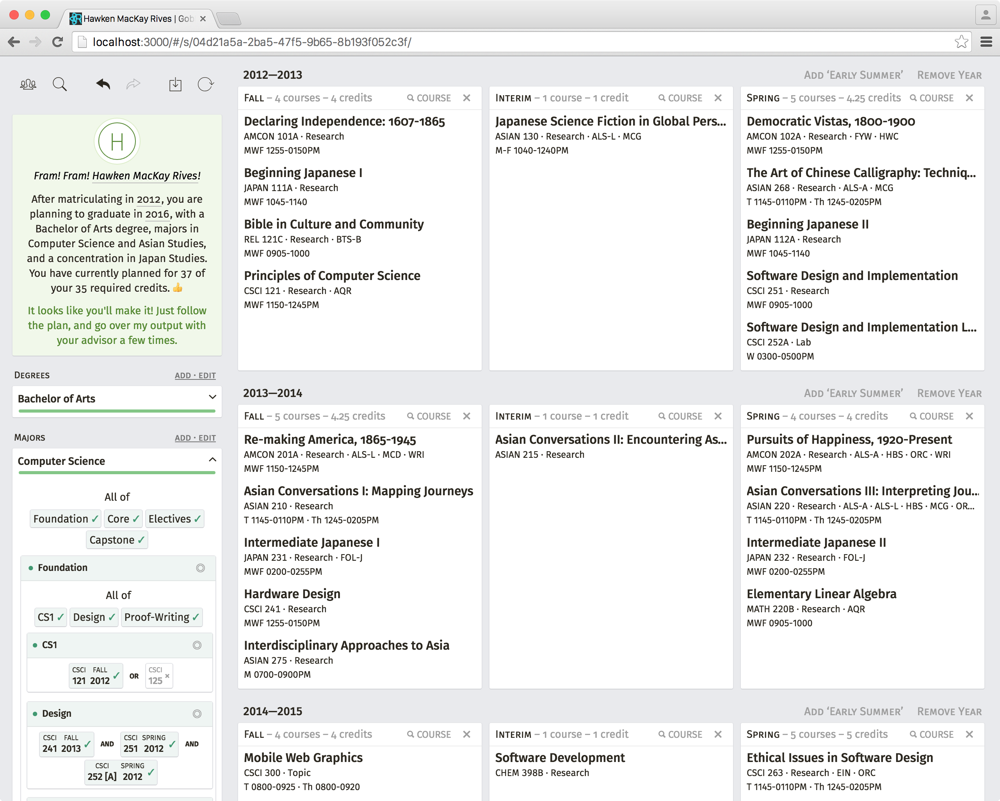
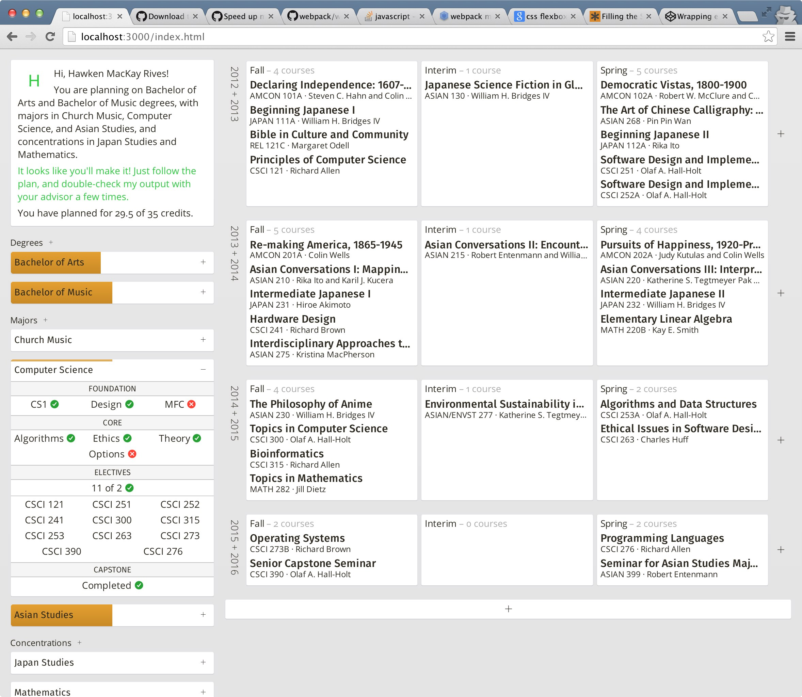

# Gobbldygook

This is a course scheduler for students at St. Olaf College. You give it your areas of study (majors, concentrations, degrees), the courses you *have* taken and are *planning* to take, and it tells you if you can graduate or not.

We have a [trello board](https://trello.com/b/cviTwkre) where we track which areas of study we are working on; if you have one in particular that you want us to work on next, let us know by either voting on the Trello card or emailing us!

## Playing
1. Visit [https://hawkrives.github.io/gobbldygook](https://hawkrives.github.io/gobbldygook)
    – Gobbldygook currently supports every major browser, except for IE (e.g., Chrome, Firefox, Safari 10+, and Microsoft Edge).

2. Push "New Student": you can either choose to import your data from the SIS, write down your information manually, or import a previously-exported student file.

3. Search for the courses you have taken and are planning on taking, and drag them into the appropriate semesters.
    – Make sure to choose the right offering for each semester!
    – If you use the "search" button on a semester, it will automatically limit your search to just that semester, which might be helpful.

## Techincal Requirements
A browser needs to support:

- IndexedDB
- Promises
- ES6 Map, Set
- ES6 Generator Functions

## Hacking
- Prerequisites: [node.js, at least v7](https://nodejs.org) and [git](https://git-scm.com).
- `git clone https://github.com/hawkrives/gobbldygook.git`
- `cd gobbldygook`
- `npm install`
- `npm start`

You can see additional commands by executing `npm run` with no arguments.

## Support
You can file an issue via [github](https://github.com/hawkrives/gobbldygook/issues/), or you can send an email to the email listed on my Github profile.

## Credits
- Initial concept from @xandrasings
- Final project for Software Design, @hawkrives and @xandrasings
- So much of the internet.
- Teammate for January 2015: @drewvolz
- Professor Hanson, for agreeing to be our advisor over Interim 2014

## Screenshots

### 2015 – September

### 2014 - September

